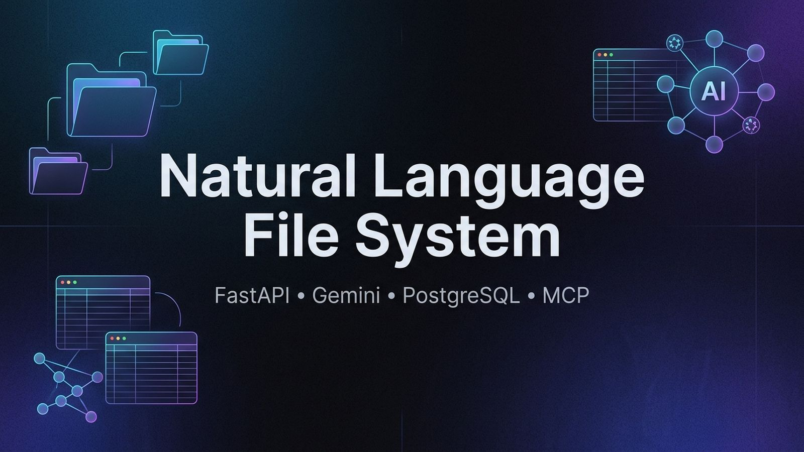
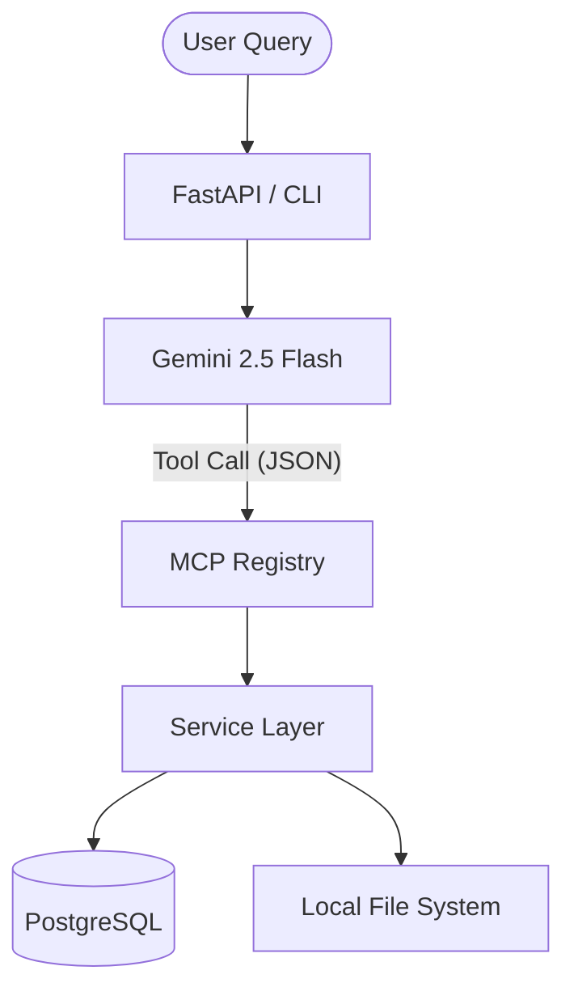
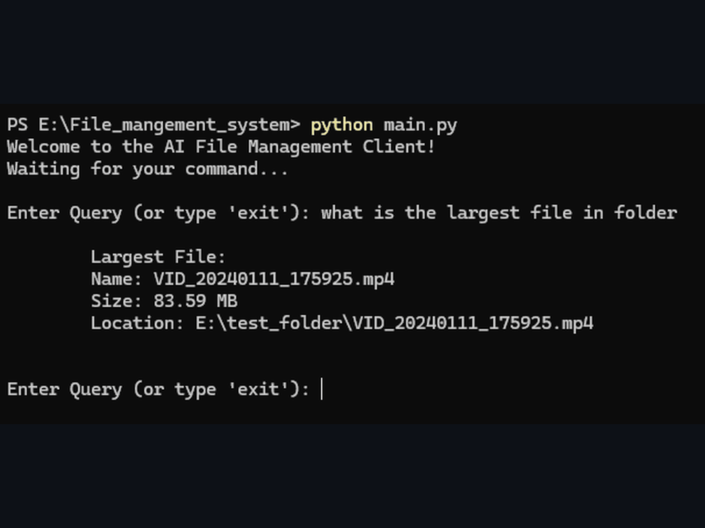

# 📂 Natural Language File Management System

<p align="center">
  
</p>

> Search, analyze, and organize your local files using natural language through an AI-powered FastAPI backend.


---

## ⚡ System Metrics at a Glance

| Metric | Details |
|--------|---------|
| **Registered MCP Tools** | 15 (Dynamic schemas for duplicate hashing, sorting, metrics) |
| **REST API Endpoints** | 12 |
| **Supported File Categories** | 8 (Images, Videos, Documents, Code, Archives, Audio, etc.) |
| **Database Tables** | 3 (Users, Files, Tasks) |
| **Unit Tests** | 9 (100% pass rate covering service and utility logic) |

---

## ✨ Key Features

*   **Natural Language File Search**: Query files using plain English (e.g., *"Find my largest files"*).
*   **Automatic File Organization**: Automatically groups files into categorized directories depending on their extension.
*   **Duplicate Detection (SHA-256)**: Matches files based on content hash rather than filenames, avoiding false positives.
*   **Metadata Indexing**: Keeps local file metadata in sync with PostgreSQL for low-latency queries.
*   **REST API + CLI Support**: Standardized JSON communication suitable for both CLI execution and API integrations.

---

## 🏗️ Architecture & Flow

Instead of letting the LLM execute arbitrary code, the AI acts purely as a **decision-making router** that maps natural language queries to structured tool schemas. The backend service layer handles validation, database transactions, and physical filesystem modifications.



### 🧠 Why This Architecture?

*   **FastAPI & Dependency Injection**: Used for high-performance async routing and clean injection of database sessions and registry states.
*   **PostgreSQL Indexing**: Scanning physical disks is slow. Storing file metadata in PostgreSQL allows instant queries on file attributes, sizes, and hashes.
*   **Service Layer Separation**: Decoupling the CLI client and FastAPI routers from business logic allows unit testing database queries in isolation using SQLite memory databases.
*   **Model Context Protocol (MCP)**: Keeps the LLM isolated. Gemini cannot execute arbitrary bash or python code; it can only request execution of registered tools.
*   **SHA-256 Content Hashing**: Identifies duplicate files by content rather than filename, avoiding false positives.

For detailed project execution flows, see [docs/project_flow.md](docs/project_flow.md) and [docs/overview.md](docs/overview.md).

---

## 📸 Demonstration

### Interactive CLI & Tool Execution



*Example Query:* `"Show my largest video file"`
*Example Output:*
```text
Largest File
Name      : movie.mp4
Size      : 742.15 MB
Location  : D:/Downloads/movie.mp4
```

*Example Sorting Output:*
```text
Target Folder: Downloads
Status       : Completed
Moved Files  : 52
Skipped      : 1
Failed       : 0
```

---

## 🚀 Quick Start

### 1. Prerequisites & Environment Setup
Make sure you have Python 3.11+ and PostgreSQL 15+ installed. Clone the repository:
```bash
git clone https://github.com/Shubham-Soni-Coder/natural-language-file-system.git
cd natural-language-file-system
```

Copy the `.env.example` template to `.env`:
*   **Windows (Command Prompt):** `copy .env.example .env`
*   **Linux/macOS:** `cp .env.example .env`

Open `.env` in a text editor and configure the variables:

```env
# Database
DB_USER=postgres
DB_PASSWORD=your_postgres_password
DB_HOST=localhost
DB_PORT=5432
DB_NAME=ai_file_system

# AI
GEMINI_API_KEY=your_gemini_api_key
GEMINI_MODEL=gemini-3.5-flash

# Authentication
SECRET_KEY=your_jwt_secret_key
ALGORITHM=HS256
ACCESS_TOKEN_EXPIRE_MINUTES=30

# Folder Path 
FOLDER_PATH=/path/to/target/folder
```

### 2. Database Initialization
Log into PostgreSQL via your terminal or GUI and create the database:
```sql
CREATE DATABASE ai_file_system;
```

### 3. Run the Services
Create a virtual environment, activate it, install dependencies, and run the FastAPI server:

```bash
# Setup & activate virtual environment
# Windows:
python -m venv venv
venv\Scripts\activate

# Linux/macOS:
python3 -m venv venv
source venv/bin/activate

# Install packages
pip install -r requirements.txt

# Start backend server
uvicorn app.app:app --reload
```

In a separate terminal, launch the CLI client:
```bash
python main.py
```
*Try queries like:* `"Show duplicate images"` or `"Organize my Downloads folder"`.

---

## 🧪 Testing

Run unit tests to verify database functions and filesystem utility helpers:
```bash
pytest tests/
```

For more testing details, see [tests/test_db_service.py](tests/test_db_service.py) and [tests/test_file_utils.py](tests/test_file_utils.py).

---

## 📖 Lessons Learned

Building this project taught me how to separate AI reasoning from backend execution using the Model Context Protocol (MCP). I learned how to design service-oriented architectures in FastAPI, handle database transactions in SQLAlchemy, and synchronize database metadata with physical filesystem operations in real-time. 

The biggest engineering challenge was ensuring file sorting operations remain synchronized with the database in real-time. I solved this by wrapping filesystem moves and database updates in a unified transaction-like service layer, preventing metadata drift.

---

## 🛣️ Future Roadmap

*   [ ] **Alembic Database Migrations**: Seamless schema updates as new metadata structures are introduced.
*   [ ] **Async Task Queues**: Move heavy indexing and folder scanning operations to background workers (Celery/Redis).
*   [ ] **Docker Support**: Containerize FastAPI, PostgreSQL, and Redis cache for single-command deployments.
*   [ ] **Multi-User Workspace Isolation**: Implement JWT-based directory path access controls to isolate user sandboxes.

---

## 👨‍💻 Author

**Shubham Soni**  
*Backend & AI Systems Developer*  
Interested in FastAPI, LLM Applications, System Design, and AI-powered Backend Engineering.
*   **GitHub**: [Shubham-Soni-Coder](https://github.com/Shubham-Soni-Coder)
*   **LinkedIn**: [Shubham Soni](https://www.linkedin.com/in/shubham-soni-coder)

---

## 📄 License

This project is licensed under the [MIT License](LICENSE).
