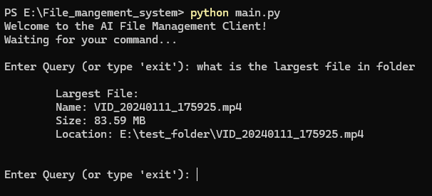
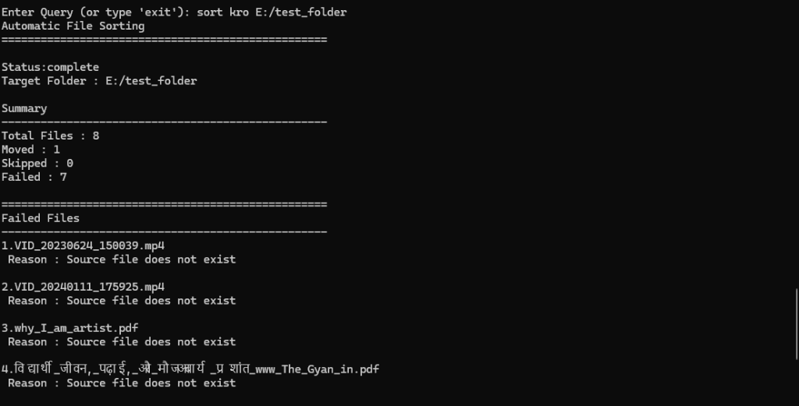
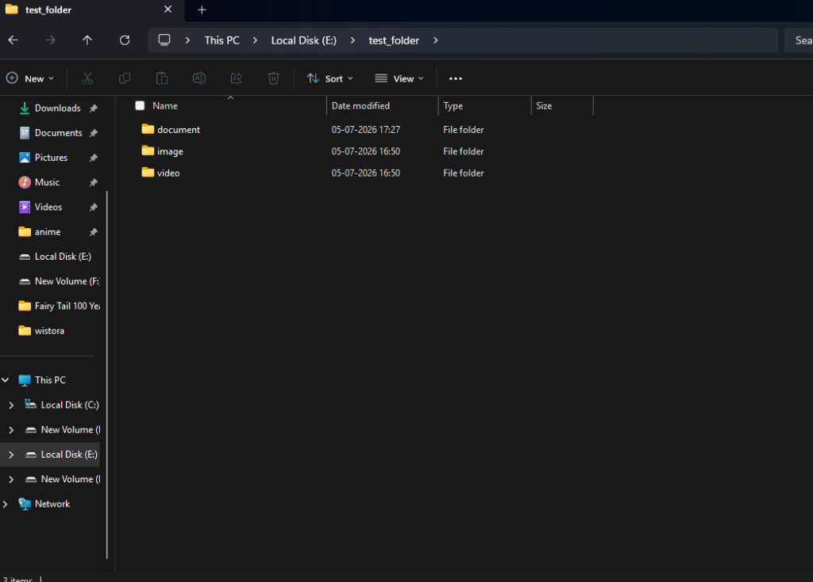

# 📂 Natural Language File Management System

> An AI-powered file management system that uses Gemini and the Model Context Protocol (MCP) to analyze and organize local files using natural language.

---


🗺️ **[Project Flow](docs/project_flow.md)** | 📖 **[System Overview](docs/overview.md)** | 📈 **[Project Roadmap](docs/project_roadmap.md)** | ⚖️ **[MIT License](LICENSE)**

This project is an AI-powered file management system that bridges Google's Gemini model with the local file system using the Model Context Protocol (MCP). Users can analyze, search, and organize files through natural language instead of manually browsing folders.

---

## 🚀 Key Features

- **📊 Intelligent File & Folder Stats:** Get real-time total count of files, folders, and total size of folders in human-readable formats (KB/MB/GB).
- **🔍 File Search & Discovery:** Locate the largest files, largest direct child folders, and oldest/newest files in any folder.
- **🖼️ File Type Distribution:** Categorize files by extensions or groups (e.g., Python, video, image, document) and retrieve distribution statistics.
- **🧹 Duplicate File Detection:** Scan and group files by their SHA-256 content hashes, avoiding false positives (like matching identical names but different content).
- **🗂️ Automatic Sorting (Organize):** Automatically organize files into categorized directories (such as `python/`, `image/`, `video/`, `document/`, `text/`, `audio/`, `archive/`, `code/`, `extra/`) depending on their extension, and automatically synchronizes file movements with the database.
- **🧠 AI Reasoning System:** Maps natural language queries (e.g., *"Show me duplicate images"*) into specific MCP tool actions using the Gemini-2.5-flash model with structured JSON formatting.

---

## 🛠️ Tech Stack
- Python 3.11+
- FastAPI
- SQLAlchemy
- PostgreSQL
- Google Generative AI SDK
- MCP (Model Context Protocol)

---

## 📐 System Architecture

Below is a conceptual data and execution flow of the system:

```text
User CLI / Client
       │ (Natural Language Command)
       ▼
 FastAPI Router
       │ (Sends Query & Registered Tool Metadata)
       ▼
   AiDriver (Gemini)
       │ (Selects appropriate tool & outputs Structured JSON)
       ▼
  MCP Registry
       │ (Invokes registered Python handler)
       ▼
   DBService ◄───────────────┐
       │ (Executes Queries)   │ (Reads File Meta)
       ▼                      ▼
  PostgreSQL             File System
```

> [!NOTE]
> For a detailed architectural analysis, project flows, and recommendations, check out the files inside the **[docs/](file:///e:/File_mangement_system/docs)** directory.

---

## 📁 Project Structure

```text
├── app/                       # FastAPI application & configurations
│   ├── app.py                 # FastAPI initialization and router registrations
│   ├── dependencies.py        # Dependency injection (database session, AI driver, MCP registry)
│   └── exception_handlers.py  # Global error logging and response sanitization
├── core/                      # Main execution engine
│   ├── ai_driver.py           # Gemini SDK wrapper and system instructions
│   ├── file_utils.py          # Filesystem walking, metadata, and SHA-256 hashing
│   └── mcp_registry.py        # MCP Tool registry maps queries to Python functions
├── models/                    # SQLAlchemy database tables
│   ├── file_model.py          # Files table (path, parent_path, size, extension, hash, user_id)
│   ├── task_model.py          # Long-running tasks table
│   └── user_model.py          # User authentication and ownership table
├── routes/                    # API endpoints
│   ├── execute_router.py      # Triggering registered tools directly
│   ├── file_router.py         # File ingestion endpoints
│   ├── query_router.py        # Natural language processing query router
│   ├── server_router.py       # General server health and registry tools
│   ├── start_router.py        # Startup filesystem indexing hook
│   └── user_router.py         # User management
├── services/                  # Database service layer & operations
│   ├── db_service.py          # File/Folder query logic, duplicates, and auto-sorting
│   ├── file_service.py        # Ingestion pipeline and database batch insert
│   ├── query_service.py       # Orchestrates query translation and execution
│   ├── task_service.py        # Async task tracker
│   └── user_service.py        # User CRUD services
├── utils/                     # Database setups, loggers, and configs
├── main.py                    # Interactive Command Line Client
└── testing.py                 # Local test runner script
```

---

## 📖 Additional Documentation

For more in-depth technical details and architectural recommendations, refer to the documents in the [docs/](docs) directory:
- ⚙️ **[System Overview & Rules](docs/overview.md):** Core objectives, rules of client-server isolation, and validation flows.
- 🗺️ **[Project Flow](docs/project_flow.md):** Step-by-step logic flow diagrams explaining query translation and tool execution.
- 📈 **[Project Roadmap](docs/project_roadmap.md):** A checklist of completed milestones and upcoming backlog tasks.
- 🔍 **[Initial Problem Analysis](docs/project_problem_analysis.md):** Pre-v1.0 audit log listing resolved bugs (for archival reference).
- 📐 **[Architecture Recommendations](docs/architecture_recommendations.md):** Architectural advice on file splitting, caching, and performance optimizations.

---

## ⚙️ Setup & Installation

### 1. Clone the Repository
```bash
git clone https://github.com/Shubham-Soni-Coder/natural-language-file-system.git
cd natural-language-file-system
```

### 2. Setup Virtual Environment
Create a virtual environment and activate it:
```bash
# Windows
python -m venv venv
venv\Scripts\activate

# macOS/Linux
python3 -m venv venv
source venv/bin/activate
```

### 3. Install Dependencies
```bash
pip install -r requirements.txt
```

### 4. Environment Configuration (`.env`)
Copy the environment template file:
```bash
copy .env.example .env
```
Open the `.env` file and fill in your database credentials and your Gemini API Key.

### 5. Running the Backend Server
Start the FastAPI backend server using Uvicorn. The application scans the configured target directory during startup and synchronizes metadata to the database:
```bash
uvicorn app.app:app --reload
```

### 6. Running the CLI Client
Run the interactive CLI client to issue natural language commands:
```bash
python main.py
```

*Example Query Session:*
```text
Welcome to the AI File Management Client!
Waiting for your command...

Enter Query (or type 'exit'): what is my largest file?
Largest File:
Name: movie.mp4
Size: 742.15 MB
Location: E:\test_folder\movie.mp4

Enter Query (or type 'exit'): organize my folders
Automatic File Sorting
==================================================
Status: complete
Target Folder : E:/test_folder

Summary
--------------------------------------------------
Total Files : 5
Moved : 5
Skipped : 0
Failed : 0
==================================================
All files were sorted successfully.
```

---

## 🖼️ Screenshots

### CLI Query Session


### Sorting Results



---

## 🧪 Testing

The project contains unit tests located in the `/tests` folder. You can run them using `pytest` inside your virtual environment:
```bash
pytest tests/
```

---

## 🗺️ Roadmap

- [ ] **Dynamic Folder Scanning:** Expose tools allowing the AI to scan any directory dynamically rather than rely on startup configurations.
- [ ] **Async Background Workers:** Move physical disk sorting and heavy indexing scans to background task workers (e.g. Celery / RQ).
- [ ] **Alembic Database Migrations:** Integrate Alembic to easily handle database migrations and schema changes.
- [ ] **Docker Support:** Containerize the FastAPI backend and database services using Docker & Docker Compose.
- [ ] **REST API Documentation:** Expand and export Swagger OpenAPI documentation for all endpoint endpoints.
- [ ] **Better Test Coverage:** Implement more extensive tests covering DB query operations and tool execution flows.

---

## 📄 License

This project is licensed under the [MIT License](LICENSE).
